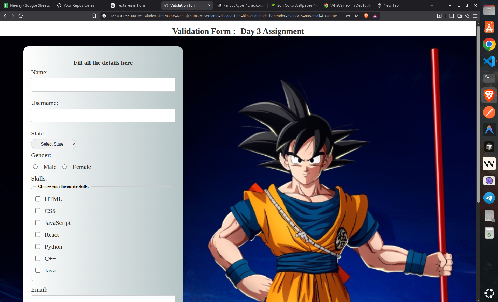
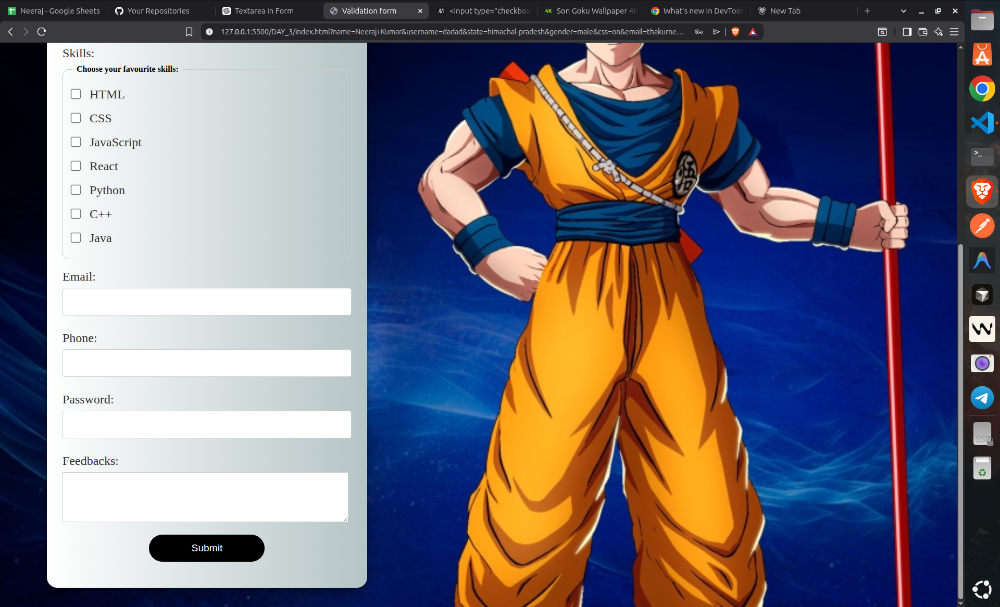

# Day 3 Assignment

This folder contains a validation form built using HTML and CSS.

## Project Files

- [index.html](index.html)
- [output1.png](output1.png)
- [output2.png](output2.png)

## Features

- Form layout with styled inputs
- Gender radio buttons
- Skills checkbox section using `fieldset` and `legend`
- Email, phone, and password validation
- Background image with a centered form card

## Output

## How to Use

1. Open `index.html` in a web browser.
2. Fill out the form fields.
3. Check the validation behavior and layout.
