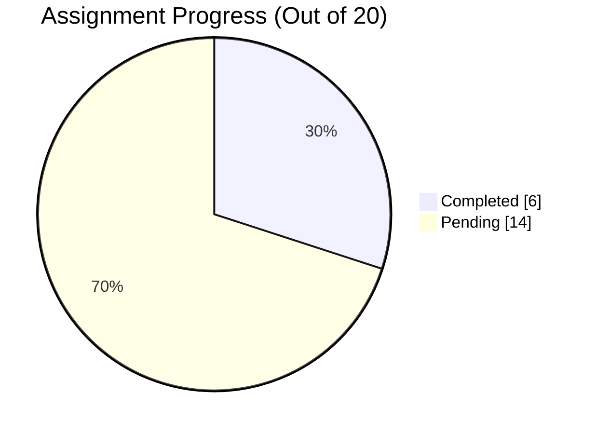

# Frontend Learning Plan and Assignments Tracker

This repository tracks daily topics and assignments for HTML and CSS practice.

## Status Legend

- Done: Completed
- TODO: Pending

## Progress Snapshot

- Completed items: 6
- Pending items: 14
- Current focus date: 2026-04-09

## Progress Chart

- Total tasks: 20
- Completed: 6
- Pending: 14
- Completion: 30%

```text
Progress: [██████░░░░░░░░░░░░░░] 6/20 (30%)
```



## Date-wise Task Plan

### 2026-04-08 ✅

- Topic 1: HTML Fundamentals
  - HTML Boilerplate, DOCTYPE, head/body, tags, attributes, nesting, indentation best practices
  - Status: Done
- Assignment 1.1: Create a Resume Webpage using proper HTML structure
  - Status: Done
  - Repo link: https://github.com/Neerajkumar151/Assignments/tree/main/DAY_1
  - Feedback:
    - Avoid duplicate CSS rules (a{} .a{}).
    - Avoid outdated layout methods like float (this can nreak layout).
    - Maintain proper heading hierarchy.

### 2026-04-09 ✅

- Topic 2: Text and Media Elements
  - Headings, paragraphs, lists (ul/ol/dl), anchor tags, images, relative vs absolute paths, basic tables
  - Status: Done
- Assignment 2.1: Build a Blog Page with images, links, and multiple sections
  - Status: Done
  - Repo link: https://github.com/Neerajkumar151/Assignments/tree/main/DAY_2

### 2026-04-10 ⏳

- Topic 3: Forms (Real-world usage)
  - Form tag, input types, label, textarea, select, radio/checkbox, validation (required, pattern), basic accessibility
  - Status: TODO
- Assignment 3.1: Create a complete Registration Form with validations
  - Status: TODO

### 2026-04-13 ⏳

- Topic 4: Semantic HTML + SEO
  - Semantic tags (header, footer, section, article, nav), meta tags, alt attributes, favicon, accessibility basics
  - Status: TODO
- Assignment 4.1: Refactor previous pages into semantic HTML + add SEO tags
  - Status: TODO

### 2026-04-14 ⏳

- Topic 5: CSS Fundamentals
  - CSS syntax, selectors (class/id/element), colors, units (px, %, rem, em), box model, margin/padding/border
  - Status: TODO
- Assignment 5.1: Style Resume Page with proper spacing, colors, typography
  - Status: TODO

### 2026-04-15 ⏳

- Topic 6: CSS Layout Basics
  - display (block, inline, inline-block), position (relative, absolute, fixed), z-index, overflow
  - Status: TODO
- Assignment 6.1: Create a webpage with fixed header + scrollable content
  - Status: TODO

### 2026-04-16 ⏳

- Topic 7: Flexbox (Industry Must)
  - flex container, flex items, justify-content, align-items, flex-wrap, gap, alignment tricks
  - Status: TODO
- Assignment 7.1: Build responsive card layout (3-4 cards) using Flexbox
  - Status: TODO

### 2026-04-17 ⏳

- Topic 8: CSS Grid + Responsive Design
  - grid basics, grid-template-columns/rows, gap, layout structuring, media queries, breakpoints
  - Status: TODO
- Assignment 8.1: Create a responsive dashboard layout using Grid + media queries
  - Status: TODO

### 2026-04-20 ⏳

- Topic 9: UI Components (Practical UI Dev)
  - Navbar, buttons, cards, forms styling, shadows, border-radius, hover effects, reusable utility classes
  - Status: TODO
- Assignment 9.1: Build a Landing Page UI (Navbar + Hero + Cards + Footer)
  - Status: TODO

### 2026-04-21 ⏳

- Topic 10: Advanced CSS + Final Project
  - Transitions, animations, best practices, folder structure, code cleanup, responsiveness testing
  - Status: TODO
- Assignment 10.1: Build a fully responsive website (Home + Contact Form + Components) using all concepts
  - Status: TODO

## Detailed Tracker Table

| S. No. | Topic | Sub-Topic | Planned Start Date | Planned End Date | Actual Start Date | Actual End Date | Status | Comments | Assignment Feedback |
|---|---|---|---|---|---|---|---|---|---|
| 1 | HTML Fundamentals | HTML Boilerplate, DOCTYPE, head/body, tags, attributes, nesting, indentation best practices | 2026-04-08 | 2026-04-08 | 07-04-2026 | 07-04-2026 | Done |  |  |
| 1.1 | HTML Fundamentals | Assignment: Create a Resume Webpage using proper HTML structure | 2026-04-08 | 2026-04-08 | 07-04-2026 | 08-04-2026 | Done | https://github.com/Neerajkumar151/Assignments | 1. Avoid duplicate CSS rules (a{} .a{}); 2. Avoid outdated layout methods like float (this can nreak layout); 3. Maintain proper heading hierarchy |
| 2 | Text and Media Elements | Headings, paragraphs, lists (ul/ol/dl), anchor tags, images, relative vs absolute paths, basic tables | 2026-04-09 | 2026-04-09 | 09-04-2026 | 09-04-2026 | Done |  |  |
| 2.1 | Text and Media Elements | Assignment: Build a Blog Page with images, links, and multiple sections | 2026-04-09 | 2026-04-09 | 09-04-2026 | 09-04-2026 | Done |  |  |
| 3 | Forms (Real-world usage) | Form tag, input types, label, textarea, select, radio/checkbox, validation (required, pattern), basic accessibility | 2026-04-10 | 2026-04-10 |  |  | TODO |  |  |
| 3.1 | Forms (Real-world usage) | Assignment: Create a complete Registration Form with validations | 2026-04-10 | 2026-04-10 |  |  | TODO |  |  |
| 4 | Semantic HTML + SEO | Semantic tags (header, footer, section, article, nav), meta tags, alt attributes, favicon, accessibility basics | 2026-04-13 | 2026-04-13 |  |  | TODO |  |  |
| 4.1 | Semantic HTML + SEO | Assignment: Refactor previous pages into semantic HTML + add SEO tags | 2026-04-13 | 2026-04-13 |  |  | TODO |  |  |
| 5 | CSS Fundamentals | CSS syntax, selectors (class/id/element), colors, units (px, %, rem, em), box model, margin/padding/border | 2026-04-14 | 2026-04-14 |  |  | TODO |  |  |
| 5.1 | CSS Fundamentals | Assignment: Style Resume Page with proper spacing, colors, typography | 2026-04-14 | 2026-04-14 |  |  | TODO |  |  |
| 6 | CSS Layout Basics | display (block, inline, inline-block), position (relative, absolute, fixed), z-index, overflow | 2026-04-15 | 2026-04-15 |  |  | TODO |  |  |
| 6.1 | CSS Layout Basics | Assignment: Create a webpage with fixed header + scrollable content | 2026-04-15 | 2026-04-15 |  |  | TODO |  |  |
| 7 | Flexbox (Industry Must) | flex container, flex items, justify-content, align-items, flex-wrap, gap, alignment tricks | 2026-04-16 | 2026-04-16 |  |  | TODO |  |  |
| 7.1 | Flexbox (Industry Must) | Assignment: Build responsive card layout (3-4 cards) using Flexbox | 2026-04-16 | 2026-04-16 |  |  | TODO |  |  |
| 8 | CSS Grid + Responsive Design | grid basics, grid-template-columns/rows, gap, layout structuring, media queries, breakpoints | 2026-04-17 | 2026-04-17 |  |  | TODO |  |  |
| 8.1 | CSS Grid + Responsive Design | Assignment: Create a responsive dashboard layout using Grid + media queries | 2026-04-17 | 2026-04-17 |  |  | TODO |  |  |
| 9 | UI Components (Practical UI Dev) | Navbar, buttons, cards, forms styling, shadows, border-radius, hover effects, reusable utility classes | 2026-04-20 | 2026-04-20 |  |  | TODO |  |  |
| 9.1 | UI Components (Practical UI Dev) | Assignment: Build a Landing Page UI (Navbar + Hero + Cards + Footer) | 2026-04-20 | 2026-04-20 |  |  | TODO |  |  |
| 10 | Advanced CSS + Final Project | Transitions, animations, best practices, folder structure, code cleanup, responsiveness testing | 2026-04-21 | 2026-04-21 |  |  | TODO |  |  |
| 10.1 | Advanced CSS + Final Project | Final Assignment: Build a fully responsive website (Home + Contact Form + Components) using all concepts | 2026-04-21 | 2026-04-21 |  |  | TODO |  |  |

